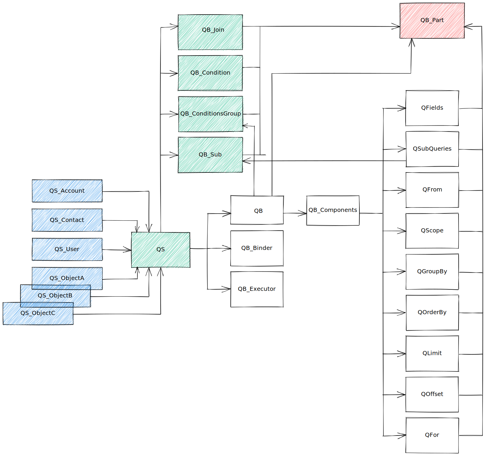

Dynamic SOQL refers to the creation of a SOQL string at run time with Apex code. Dynamic SOQL enables you to create more flexible applications. For example, you can create a search based on input from an end user or update records with varying field names.

## Architecture

Each query clause (`SELECT`, `FROM`, `WHERE`, `LIMIT`) is represented by concrete Apex Class (Single Responsibility Principle).

| Index | Statement         | Apex Class                                            |
| ----- | ----------------- | ----------------------------------------------------- |
| 1     | SELECT            | `QB_Fields`                                           |
| 2     | subQuery          | `QB_SubQuery`                                         |
| 3     | FROM              | `QB_From`                                             |
| 4     | USING SCOPE       | `QB_Scope`                                            |
| 5     | WHERE             | `QB_ConditionsGroup`, `QB_Conditions`, `QB_Condition` |
| 6     | SECURITY_ENFORCED | `QB_WithSecurityEnforced`                             |
| 7     | GROUP BY          | `QB_GroupBy`                                          |
| 8     | ORDER BY          | `QB_OrderBy`                                          |
| 9     | LIMIT             | `QB_Limit`                                            |
| 10    | OFFSET            | `QB_Offset`                                           |
| 11    | FOR               | `QB_For`                                              |

Query Builder (QB) framework uses [Composite](https://refactoring.guru/design-patterns/composite) pattern.
All classes mentioned above and the main class `QB` extends `QB_QueryClause` abstract class.

```java
public abstract class QB_QueryClause {

    public abstract String build();

    public virtual String validate() {
        return '';
    }
}
```

Classes needs to implement `build()` method that return SOQL part. `validate()` can be use to provide additional validation that will be executed during build phase.




## Usage

Developer should based on:
- `QB.cls` - to build SOQL.
- `QB_Condition` - to prepare condition.
- `QB_TestMock` - to mock query result in unit tests.

```java
new QB(sObjectType)
    // Fields
    .withFields(List<sObjectField> fields)
    .withRelatedFields(String commaSeparatedFieldsNames)
    // SubQuery
    .withSubQuery(QB subQueryBuilder)
    .withSubQueries(List<QB> subQueryBuilders)
    // Scope
    .withDelegatedScope()
    .withMineScope()
    .withMineAndMyGroupsScope()
    .withMyTerritoryScope()
    .withMyTeamTerritoryScope()
    .withTeamScope()
    // Where
    .withWhere(QB_Condition queryCondition)
    .withWhere(List<QB_Condition> queryConditions)
    .withWhere(List<QB_Condition> queryConditions, String conditionOrder)
    .withWhere(QB_Conditions queryConditions)
    .withWhere(QB_ConditionsGroup queryConditionsBuilder)
    // Security
    .withoutSecurityEnforced() // WITH SECURITY ENFORCED by default
    .withoutSharing() // cxecuted with sharing by default
    // Group By
    .withGroupBy(sObjectField field)
    .withGroupBy(List<sObjectField> fields)
    // Order By
    .withAscOrder(sObjectField field)
    .withAscOrder(String field)
    .withDescOrder(sObjectField field)
    .withDescOrder(String field)
    // Limit
    .withLimit(Integer soqlLimit)
    // Offset
    .withOffset(Integer soqlOffset)
    // For
    .withForReference()
    .withForView()
    .withForUpdate()
    .withAllRows()
    // Mocking - Allow mocking in unit tests
    .withMocking(String queryIdentifier)
    // Execute
    .toSObjectList()
    .toSObject()
```

```java
Contact myContact = new QS_Contact()
                        .withField(new List<sObjectField>{ Contact.Id, Contact.FirstName, Contact.LastName })
                        .toWhere(new QB_Condition(Contact.Name).equal('Contact1'))
                        .toObject();
```

## Benefits

### SOQL Errors handling

No *List has no rows for assignment to SObject* error. When record not found value will be set to null.

```java
Contact myContact = [SELECT Id, Name FROM Contact WHERE Name = 'invalidName'];
// Error: List has no rows for assignment to SObject

Contact myContact = new QS_Contact()
                        .withFields(new List<sObjectField>{ Contact.Id, Contact.Name })
                        .withWhere(new QB_Condition(Contact.Name).equal('invalidName'))
                        .toObject();
// null
```

### Easy to debug

### External objects mocking

External objects cannot be insert during the test. Selectors provide easy way to mock the data.

### One place to manage all SOQLs

## TODO

- [ ] SOQL Query Performance sugestion
- [ ] QB_TestMock
- [ ] Custom Metadata for debugging on production
- [ ] Skip condition when null (?)

## License notes

- For proper license management each repository should contain LICENSE file similar to this one.
- each original class should contain copyright mark: © Copyright 2022, Beyond The Cloud Dev Authors
